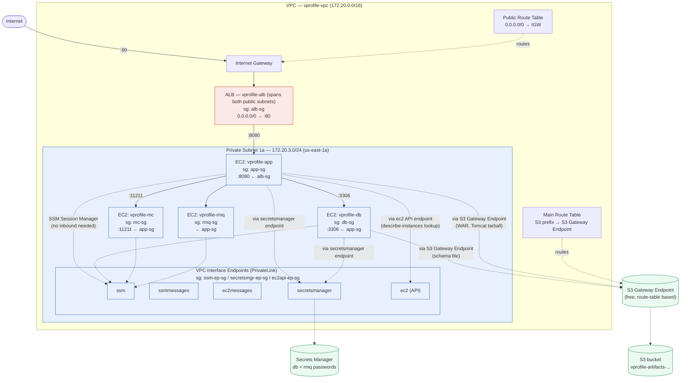
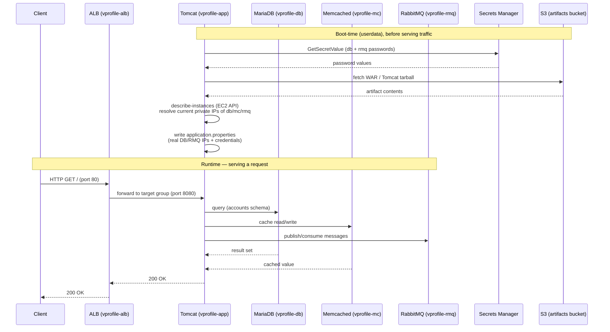

# aws-lift-and-shift

A lift-and-shift migration of the **VProfile** multi-tier Java application (Nginx/Tomcat →
Tomcat, MySQL → MariaDB, Memcached, RabbitMQ) from a local five-VM Vagrant setup onto AWS,
using EC2, a custom VPC, IAM, SSM, S3, Secrets Manager, and an Application Load Balancer.

> **VProfile is an instructor-provided reference application, not something I wrote.** It's a
> standard multi-tier Java app used across DevOps courses specifically for practicing
> infrastructure and deployment work — the application code itself was never the point. What
> this project demonstrates is everything *around* it: network design, IAM, service discovery,
> credential management, load balancing, and the troubleshooting that came with all of it.

This is **Project 1 of a 5-project DevOps portfolio** built alongside the *Decoding DevOps*
Udemy course. Later projects build on this one's architecture (Terraform codifies what was
hand-built here; Kubernetes/GitOps is the eventual capstone).

---

## Problem Statement

Take an application designed to run on five manually-provisioned local VMs and re-architect it
onto AWS using cloud-native patterns — without simply "lifting" the VM layout unchanged.
Concretely: isolate the backend tier from the public internet, remove hardcoded credentials,
replace SSH access with SSM Session Manager, and front the app with a load balancer — all while
keeping cost near zero and documenting every real failure encountered along the way.

---

## Architecture

Full reasoning behind each design choice lives in [`docs/architecture.md`](docs/architecture.md)
and [`docs/decisions.md`](docs/decisions.md). The two diagrams below are embedded directly;
everything else is one click away.

### Network & Security

Only the ALB is public. Every backend service sits in a private subnet with no direct internet
route, no bastion host, and no inbound SSH anywhere — all instance access is via SSM Session
Manager. Every AWS service reached privately needed its **own** VPC Interface Endpoint; this was
the single most repeated lesson of the project (see Incidents #1 and #4).

### Request Flow

Credentials and backend IPs are resolved **dynamically at boot**, not hardcoded — surviving any
backend instance being relaunched with a new private IP, which happened repeatedly during
development.

---

## Tech Stack & Why

| Component | Choice | Why |
|---|---|---|
| Compute | EC2 (`t2.micro`, consistent across all instances) | Free-tier eligible; burstable performance fits this project's light, intermittent load |
| Networking | Custom VPC, 3 subnets across 2 AZs | Isolation and hands-on networking practice, rather than the default VPC |
| Access | SSM Session Manager | No bastion host, no open SSH, no key management — the SSM Agent dials out, so zero inbound rules are needed |
| Secrets | AWS Secrets Manager | Correct category fit for credentials (vs. Parameter Store's config focus); fetched at boot rather than hardcoded |
| Artifact storage | S3 + Gateway Endpoint | Free private-subnet access to S3; used for the WAR file, Tomcat tarball, and DB schema, avoiding public-internet dependency from private instances |
| Load Balancing | Application Load Balancer | Standard front door for HTTP(S) traffic to a target group of EC2 instances |
| RabbitMQ delivery | Golden AMI | Amazon Linux 2023 doesn't ship the required packages by default; baking them into an AMI avoided introducing a NAT Gateway just to solve one package gap |
| Service discovery | `ec2:DescribeInstances` tag lookup | Deliberate simplification — see Limitations below |

---

## Setup & Reproduction

**Current state:** the ALB and all five VPC Interface Endpoints have been **deleted** to stop
ongoing charges once verification evidence was fully captured (see Cleanup below). What follows
is how to bring the environment back to a fully live, demoable state.

1. Recreate the five VPC Interface Endpoints (`ssm`, `ssmmessages`, `ec2messages`,
   `secretsmanager`, `ec2`) in the private subnet — commands and required SGs are documented in
   `docs/incidents.md` (Incidents #1 and #4).
2. Start the four stopped EC2 instances (`vprofile-db`, `vprofile-mc`, `vprofile-rmq`,
   `vprofile-app`) — all instance IDs are in `PROGRESS.md`'s Resource Reference table.
3. Recreate the ALB and target group, pointing to `vprofile-app` on port 8080 with health check
   path `/`.
4. Verify: `curl -I` against the ALB's DNS name should return `200` with a `Content-Length`
   matching a direct `curl -I localhost:8080` from `vprofile-app` — this exact check is what
   proved the path worked end-to-end during development.

None of this requires re-running any userdata scripts or re-diagnosing anything — every step
above is a known, previously-executed AWS CLI command.

---

## Security Notes

- No hardcoded credentials — DB and RabbitMQ passwords are fetched from Secrets Manager at boot.
- Least-privilege IAM: per-service roles, S3 access scoped to specific prefixes, Secrets Manager
  access scoped to specific secret ARNs. The one necessary exception is `ec2:DescribeInstances`
  on the app role, which AWS doesn't support resource-level scoping for — documented, not hidden.
- Zero inbound SSH; all instance access via SSM Session Manager.
- Security groups scoped to specific source SGs (e.g., `db-sg` only accepts 3306 from `app-sg`),
  not open CIDR ranges, except the ALB's intentionally public port 80.
- **Known simplification:** the RabbitMQ `test` user has unrestricted admin permissions on the
  default vhost — acceptable for a single-app portfolio broker, not least-privilege for a
  production system.

---

## Troubleshooting

Five real incidents were hit and resolved during this project — missing network paths, a
packaging gap requiring an architectural decision (golden AMI vs. NAT Gateway vs. self-hosted
repo), a race condition between instance launch and endpoint creation, and a cascading Spring
config failure. Full symptom → root cause → resolution write-ups are in
[`docs/incidents.md`](docs/incidents.md) — these are genuine failures encountered during
development, not fabricated scenarios.

---

## Cleanup

All billable, easily-reproducible resources (the ALB, target group, and five VPC Interface
Endpoints) have been deleted following verification — VPC Interface Endpoints alone accounted
for ~87% of this project's AWS spend in its most active month. Full teardown reasoning and the
current resource inventory are in `PROGRESS.md`'s Cleanup section.

**Currently running/existing (minimal cost):** four stopped EC2 instances, one working golden
AMI, the VPC and its free networking components, an S3 bucket, and two Secrets Manager secrets.

---

## Lessons Learned

The full chronological study log is in [`NOTES.md`](NOTES.md). A few that came up repeatedly
enough to be worth calling out here:

- **Every AWS service reached privately needs its own VPC endpoint** — this surfaced three
  separate times (S3, Secrets Manager, then the general EC2 API), each initially assumed to be
  "covered" by an existing endpoint that turned out to be for a different, unrelated service.
- **"Running" is not "verified."** An EC2 instance reaching the `running` state only proves the
  OS booted — not that userdata succeeded or a service is actually healthy. This project's
  standard verification pattern became: check `cloud-init-output.log`, then service status, then
  an actual functional check (a real query, a real port listen check) — never trusting just one
  layer.
- **Golden AMIs bake in whatever the builder's environment happened to be at snapshot time** —
  including things you don't expect, like hostname-derived application identity (RabbitMQ's
  node name), which broke on every subsequent launch until pinned explicitly.

---

## Limitations & What Would Change for Production

Stated plainly rather than glossed over — full detail in
[`docs/course-coverage.md`](docs/course-coverage.md):

- **Service discovery** uses a live `ec2:DescribeInstances` tag lookup instead of DNS-based
  discovery (Route 53 private hosted zone or AWS Cloud Map) — functional, but not the standard
  production pattern, and the one IAM permission in this project that can't be scoped down.
- **No Auto Scaling** — single instance per tier throughout.
- **No NAT Gateway** — a deliberate cost trade-off; RabbitMQ's packaging gap was solved with a
  golden AMI instead.
- **No custom monitoring/alerting** beyond CloudWatch billing alarms — health is verified
  manually, not through a monitoring stack. This is picked up later in the portfolio, once
  there's a live Kubernetes/PaaS system worth instrumenting.
- **No HTTPS/ACM** — no custom domain to validate a certificate against at portfolio scale.

---

## Further Documentation

- [`docs/architecture.md`](docs/architecture.md) — full diagram reasoning
- [`docs/decisions.md`](docs/decisions.md) — ADR-lite decision log
- [`docs/incidents.md`](docs/incidents.md) — full incident write-ups
- [`docs/course-coverage.md`](docs/course-coverage.md) — course topic → implementation → evidence matrix
- [`PROGRESS.md`](PROGRESS.md) — full project state, resource IDs, and session history
- [`NOTES.md`](NOTES.md) — chronological study notes
