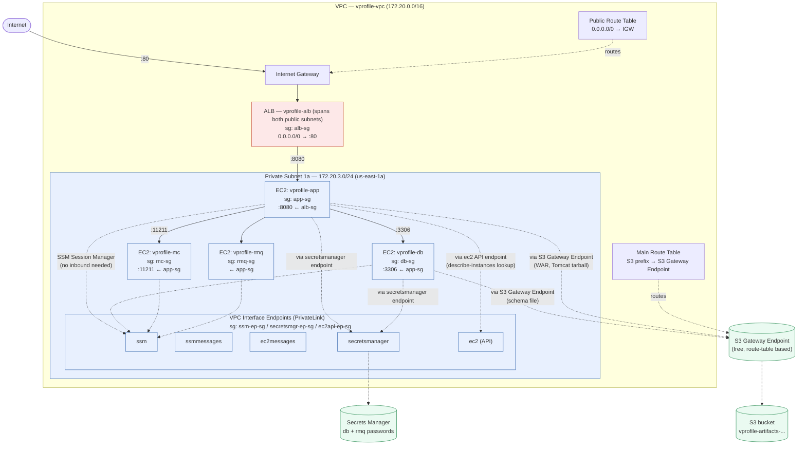
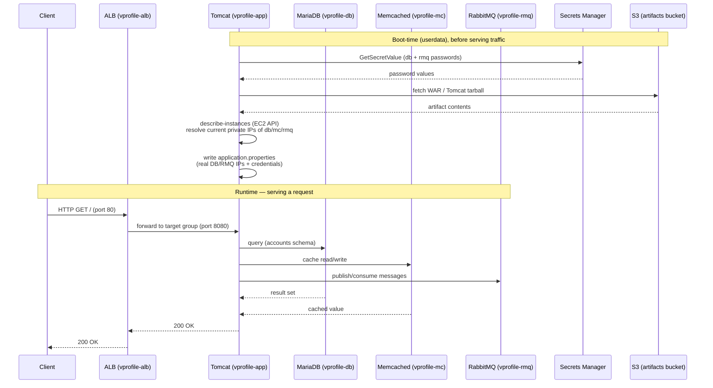

# Architecture

Two diagrams, split by concern:

1. **Network & Security Architecture** — VPC layout, subnets, security groups, and VPC endpoints.
   Answers "how is this isolated and secured?"
2. **Request Flow** — how a client request actually gets served, including the backend services,
   Secrets Manager, and S3 artifact retrieval.

Both reflect only what is actually implemented and verified in this project — no NAT Gateway,
no Route 53 (deliberately excluded; see Key Decisions in `PROGRESS.md`).

---

## 1. Network & Security Architecture

**Key points this diagram makes:**
- Only the ALB sits in public subnets; every backend service (`app`, `db`, `mc`, `rmq`) is private,
  reachable only through security-group-scoped rules from the tier in front of it.
- No NAT Gateway, no bastion host, no inbound SSH anywhere — all instance access is via SSM
  Session Manager, which requires zero inbound rules (the SSM Agent dials out).
- Every AWS service reached privately needed its **own** VPC endpoint — `ssm`, `ssmmessages`,
  `ec2messages`, `secretsmanager`, and `ec2` (API) are five separate Interface Endpoints; S3 uses
  a free Gateway Endpoint via the route table instead. This was the single most repeated lesson of
  the project (Incidents #1, and the Secrets Manager / EC2 API gaps in Incident #4).
- `vprofile-rmq-role` has IAM permission to call Secrets Manager, but the diagram deliberately
  does **not** draw that arrow: `vprofile-rmq` launches from a golden AMI with no userdata
  (verified via `describe-instances` — `UserData` is `None`), so it never actually calls Secrets
  Manager at runtime. The `test` user's password was baked into the AMI during the manual build.
  The permission is provisioned for a future AMI rebuild that adopts the same fetch-at-boot
  pattern as `db`/`app`, not an active path today — a real, currently-unused piece of IAM scope,
  named here rather than silently implied as active.

---

## 2. Request Flow

**Key points this diagram makes:**
- Config values (DB/RMQ credentials, backend IPs) are resolved **dynamically at boot**, not
  hardcoded — credentials via Secrets Manager, IPs via a live `describe-instances` lookup keyed
  off each instance's `Name` tag. This survives any backend instance being relaunched with a new
  private IP (which happened repeatedly during this project).
- The named simplification: IP discovery via `ec2:DescribeInstances` (account-wide, read-only)
  instead of proper DNS-based service discovery (Route 53 private hosted zone / AWS Cloud Map) —
  a deliberate trade-off documented in `PROGRESS.md`, not the production-recommended pattern.
- RabbitMQ ships pre-configured via a golden AMI (no boot-time install step), unlike `app`/`db`/`mc`
  which install and configure via userdata — visible in the diagram as RMQ having no userdata
  fetch step shown for itself.
